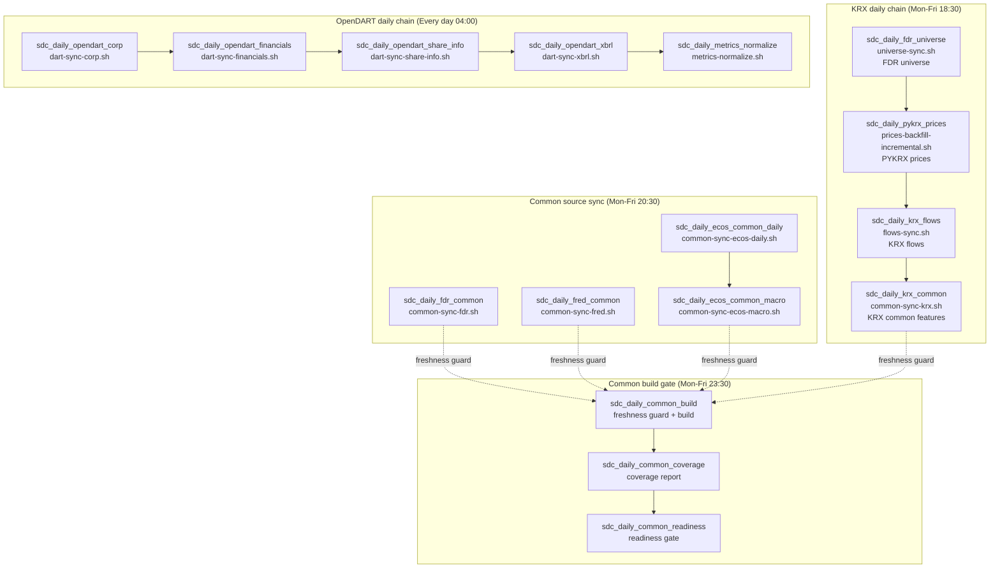

# SDC production deployment

이 디렉터리는 `sj2-server:/home/whi/apps/sdc`에 배포되는 SDC 운영 파일의 source of truth다.

- 마지막 확인: 2026-06-20 KST
- 확인한 원천: Cronicle API `GET /api/app/get_schedule/v1`, `GET /api/app/get_event/v1`, 원격 파일 `whi@sj2-server:/home/whi/apps/sdc/{compose.yaml,bin/}`
- Cronicle UI: `http://sj2-server:3012/#Schedule`
- 배포 경로: `whi@sj2-server:/home/whi/apps/sdc`
- 현재 compose image: `ghcr.io/sjleekor/sdc:v0.8.13`
- 현재 상시 기동 서비스: `db`만 기동. `collector`는 Cronicle wrapper가 `docker compose run --rm collector ...`로 작업마다 실행한다.

원격 `compose.yaml`과 `bin/*.sh` checksum은 현재 로컬 `deploy/prod`와 일치한다.

## 배포 방법

운영 파일은 서버에서 직접 수정하지 않는다. 이 디렉터리를 수정한 뒤 아래 스크립트로 반영한다.

```bash
./deploy/deploy_to_sj2.sh
```

이 스크립트는 `deploy/prod/compose.yaml`과 `deploy/prod/bin/`을 `sj2-server:/home/whi/apps/sdc`로 `rsync --delete`한다.

## Cronicle event chain

현재 배포된 Cronicle event는 16개이며 모두 `enabled=1`, `plugin=shellplug`, `category=general`, `target=maingrp`, `timezone=Asia/Seoul`, `max_children=1`, `multiplex=0`, `catch_up=0`이다. `chain_error`는 모두 비어 있으므로 실패 시 별도 실패 분기로 가지 않고 그 지점에서 chain이 멈춘다.



시간대별로 보면 아래와 같다.

```text
04:00 daily     OpenDART Corp -> Financials -> Share Info -> XBRL -> Metrics Normalize
18:30 Mon-Fri  FDR Universe -> PYKRX Prices -> KRX Flows -> KRX Common
20:30 Mon-Fri  FDR Common, FRED Common, ECOS Daily -> ECOS Macro
23:30 Mon-Fri  Common Build -> Coverage Report -> Readiness Check
```

`common_build`는 Cronicle chain으로 common source sync들을 직접 기다리지 않는다. 대신 23:30에 독립 실행되고, wrapper 내부의 `ops assert-common-freshness`가 `fdr,fred,ecos,krx` 최신성을 검사한 뒤 통과할 때만 `common build-daily`를 실행한다.

## Event 목록

| Event id | Trigger | Chain next | Wrapper | 설명 |
|---|---:|---|---|---|
| `sdc_daily_fdr_universe` | Mon-Fri 18:30 | `sdc_daily_pykrx_prices` | `universe-sync.sh` | FDR 기준 KOSPI/KOSDAQ universe를 동기화한다. |
| `sdc_daily_pykrx_prices` | chain-only | `sdc_daily_krx_flows` | `prices-backfill-incremental.sh` | 전체 시장 일봉 가격을 증분 backfill한다. 기본 lookback은 0일, 자동 range guard는 10일이다. |
| `sdc_daily_krx_flows` | chain-only | `sdc_daily_krx_common` | `flows-sync.sh` | 가격 최신일을 기준으로 KRX 수급 데이터를 증분 동기화한다. 기본 lookback은 14일, 자동 range guard는 30일이다. |
| `sdc_daily_krx_common` | chain-only | 없음 | `common-sync-krx.sh` | KRX 계열 common feature raw series를 증분 동기화한다. 현재는 `krx_flows` 성공 후에만 실행된다. |
| `sdc_daily_fdr_common` | Mon-Fri 20:30 | 없음 | `common-sync-fdr.sh` | FDR common feature raw series를 증분 동기화한다. |
| `sdc_daily_fred_common` | Mon-Fri 20:30 | 없음 | `common-sync-fred.sh` | FRED common feature raw series를 증분 동기화한다. |
| `sdc_daily_ecos_common_daily` | Mon-Fri 20:30 | `sdc_daily_ecos_common_macro` | `common-sync-ecos-daily.sh` | ECOS 일간 common feature raw series를 증분 동기화한다. |
| `sdc_daily_ecos_common_macro` | chain-only | 없음 | `common-sync-ecos-macro.sh` | ECOS 월간 macro series(`macro_cpi`, `macro_ppi`, `macro_m2`, `macro_consumer_sentiment`)를 긴 lookback으로 동기화한다. |
| `sdc_daily_common_build` | Mon-Fri 23:30 | `sdc_daily_common_coverage` | `common-build-daily.sh` | source freshness guard 통과 후 common daily fact를 증분 build한다. |
| `sdc_daily_common_coverage` | chain-only | `sdc_daily_common_readiness` | `common-coverage-report.sh` | build 결과의 coverage report를 생성한다. |
| `sdc_daily_common_readiness` | chain-only | 없음 | `common-readiness-check.sh` | readiness report를 실행하고 미달 시 실패 처리한다. |
| `sdc_daily_opendart_corp` | daily 04:00 | `sdc_daily_opendart_financials` | `dart-sync-corp.sh` | OpenDART corp master를 동기화한다. |
| `sdc_daily_opendart_financials` | chain-only | `sdc_daily_opendart_share_info` | `dart-sync-financials.sh` | OpenDART 재무제표를 증분 동기화한다. 기본 lookback은 1년, attempt guard는 10,000건이다. |
| `sdc_daily_opendart_share_info` | chain-only | `sdc_daily_opendart_xbrl` | `dart-sync-share-info.sh` | 주식수, 배당, 자기주식 관련 OpenDART 데이터를 증분 동기화한다. Cronicle script에 `DART_SHARE_INFO_MAX_ATTEMPT_TARGETS=35000` override가 있다. |
| `sdc_daily_opendart_xbrl` | chain-only | `sdc_daily_metrics_normalize` | `dart-sync-xbrl.sh` | OpenDART XBRL 데이터를 증분 동기화한다. 기본 attempt guard는 10,000건이다. |
| `sdc_daily_metrics_normalize` | chain-only | 없음 | `metrics-normalize.sh` | OpenDART raw 데이터를 `stock_metric_fact` 계열 canonical metric으로 정규화한다. 기본 lookback은 2년이다. |

## Wrapper와 lock/throttle

대부분의 daily wrapper는 `bin/lib/sdc-wrapper.sh`를 source하고 `docker compose run --rm collector ...`를 호출한다. wrapper의 주요 실행 함수는 아래와 같다.

- `sdc_run_collector`: source lock 없이 collector command를 실행한다.
- `sdc_run_daily_collector <domain> ...`: `SDC_DAILY_USE_SOURCE_LOCK=1`일 때만 host-side source lock을 잡고 실행한다.
- `sdc_run_collector_with_lock <domain> ...`: 항상 source lock을 잡고 실행한다. manual backfill wrapper에서 주로 쓴다.

source lock은 `/tmp/sdc-locks/<domain>.lock`에 `flock`을 걸고, lock 획득 직후 `/tmp/sdc-throttle/<domain>.last`를 이용해 source별 최소 간격을 둔다. lock conflict 기본 mode는 `fail`이며 conflict 시 exit code 75를 반환한다.

| Domain | 주로 쓰는 wrapper | 기본 throttle |
|---|---|---:|
| `fdr` | `universe-sync.sh`, `common-sync-fdr.sh` | 10s |
| `fred` | `common-sync-fred.sh` | 10s |
| `ecos` | `common-sync-ecos-daily.sh`, `common-sync-ecos-macro.sh` | 10s |
| `krx_marketdata` | `prices-backfill-incremental.sh`, `flows-sync.sh`, `common-sync-krx.sh`, `common-sync-pykrx.sh` | 60s |
| `opendart` | OpenDART sync wrappers, OpenDART backfill | 5s |

주의할 점:

- Cronicle event definition 자체에는 `env` 필드가 없다. event script에 직접 들어간 override는 현재 `sdc_daily_opendart_share_info`의 `DART_SHARE_INFO_MAX_ATTEMPT_TARGETS=35000`뿐이다.
- `SDC_DAILY_USE_SOURCE_LOCK`, `SDC_LOCK_WAIT_SECONDS` 같은 host-side 실행 환경값은 Cronicle process 환경까지 함께 확인해야 한다.
- 최근 KRX job log에서는 `krx_marketdata` lock 대기와 exit 75가 관찰됐다. exit 75는 같은 source domain 작업이 이미 lock을 잡고 있어 대기 시간 안에 시작하지 못했다는 뜻이다.

## 배포되어 있지만 Cronicle event가 아닌 wrapper

아래 파일은 `deploy/prod/bin/`에 배포되지만 현재 Cronicle schedule에는 등록되어 있지 않다.

| Wrapper | 용도 |
|---|---|
| `common-features-refresh.sh` | common catalog seed, source sync, build, coverage, readiness를 한 번에 순차 실행하는 수동 refresh wrapper. |
| `common-seed-catalog.sh` | common feature catalog schema/data 초기화. |
| `common-sync-pykrx.sh` | PYKRX common source 동기화. 현재 운영 필수 source에는 포함되지 않고 Cronicle event도 없다. |
| `dart-backfill-all-years.sh` | OpenDART 연도별 대량 backfill. 기본은 전체 backfill 구간을 `opendart` lock으로 감싼다. |
| `flows-backfill-range.sh` | `FLOW_START`, `FLOW_END`로 지정한 수급 range를 수동 backfill한다. 항상 `krx_marketdata` lock을 사용한다. |
| `db-init.sh` | collector의 `db init` 실행. |
| `pull-image.sh` | collector image pull. |
| `up-db.sh` | DB service 기동. |
| `validate.sh` | `validate --market all` 실행. |

`flows-sync.sh.bak.20260425_2352`는 배포 디렉터리에 남아 있는 backup 파일이며 Cronicle event에서 호출하지 않는다.

## 현재 schedule에서 특히 헷갈리기 쉬운 점

- `sdc_daily_krx_common`은 현재 독립 21:30 schedule이 아니다. 2026-06-16 23:00:17 KST에 `sdc_daily_krx_flows -> sdc_daily_krx_common` chain으로 변경됐다. 그 이전 history에는 21:30 독립 실행 기록이 남아 있을 수 있다.
- `sdc_daily_common_build`는 현재 Mon-Fri 23:30이다. 2026-06-16 22:38:06 KST에 수정됐으므로 그 이전 22:30 실행 history는 현재 schedule을 의미하지 않는다.
- `sdc_daily_opendart_share_info`는 2026-06-15 22:48:40 KST에 Cronicle script override로 `DART_SHARE_INFO_MAX_ATTEMPT_TARGETS=35000`이 들어갔다. wrapper 기본값은 10,000이므로 backlog 해소 후 계속 필요한지 재검토해야 한다.
- 모든 event는 `catch_up=0`이다. Cronicle이 꺼져 있거나 schedule 시각을 놓친 경우 자동 catch-up 실행을 기대하면 안 된다.

## 운영 점검 명령

Cronicle API key는 repo 밖의 secret 파일에서 읽고, 값 자체를 출력하거나 문서에 붙이지 않는다.

```bash
APIKEY=$(awk -F': *' '/^APIKEY:/ {print $2}' /Users/whishaw/wss_p/stock_data_collector_secrets/cronicle_info)

# 현재 schedule
curl -fsS -H "X-API-Key: $APIKEY" \
  'http://sj2-server:3012/api/app/get_schedule/v1' | jq '.rows[] | {id,title,enabled,timing,chain,modified}'

# 특정 event 최근 history
curl -fsS -H "X-API-Key: $APIKEY" \
  'http://sj2-server:3012/api/app/get_event_history/v1?id=sdc_daily_common_build&limit=5' | jq '.rows[] | {id,time_start,elapsed,code,description}'

# 특정 job log. Cronicle log API는 gzip 본문을 줄 수 있어 --compressed를 붙인다.
curl --compressed -fsS -H "X-API-Key: $APIKEY" \
  'http://sj2-server:3012/api/app/get_job_log/v1?id=<job-id>&format=text'

# 운영 compose 상태
ssh whi@sj2-server 'cd /home/whi/apps/sdc && docker compose ps'

# 운영 wrapper 확인
ssh whi@sj2-server 'cd /home/whi/apps/sdc/bin && find . -type f | sort'
```
